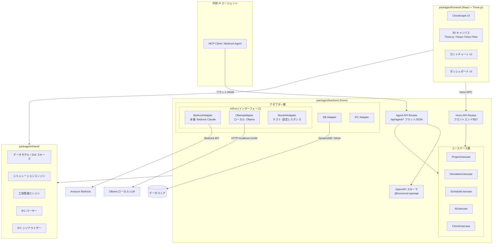
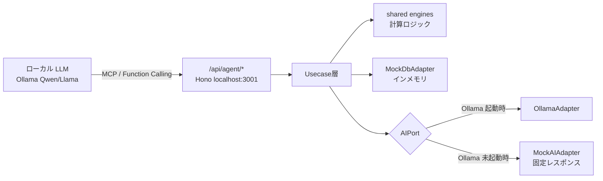
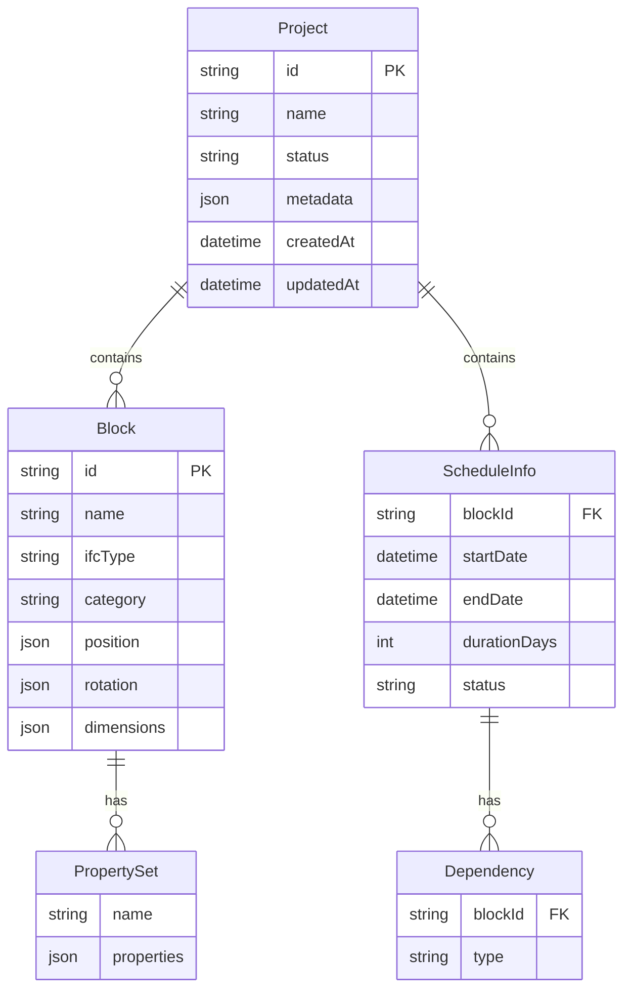

# 技術設計書: IFC レゴ BIM シミュレーター

## 概要

本ドキュメントは、レゴブロック風の直感的操作で建設モデルを構築する Web アプリケーション「IFC レゴ BIM シミュレーター」の技術設計を定義する。

既存のボイラープレート `basic-serverless-app`（TypeScript / Hono / Vitest / モノレポ構成）を基盤とし、3D レンダリング、BIM シミュレーション、工程管理、AI 連携、IFC 入出力の各機能を段階的に構築する。

### 設計方針

- **モノレポ構成の維持**: `packages/frontend`、`packages/backend`、`packages/shared` の 3 パッケージ構成を維持
- **ヘキサゴナルアーキテクチャ**: バックエンドは既存の Port/Adapter パターンを踏襲
- **型安全**: Zod スキーマによるバリデーションと Hono RPC による E2E 型安全を活用
- **段階的実装**: P1（コア機能）→ P2（BIM シミュレーション・工程管理）→ P3（チェック・AI・分析）→ P4（先進機能）の順で実装
- **AI-Ready Backend**: ボイラープレートの「AgentCore / MCP 統合ガイド」に準拠し、AI エージェントが自律的にツール（Action Group）として機能を呼び出せるバックエンドを構築する。具体的には、(1) AI 連携を Port/Adapter パターンで抽象化し本番（Bedrock）・ローカル（Ollama）・テスト（Mock）を環境変数で切替、(2) フロントエンド用 API とは別に Agent 専用のフラット JSON エンドポイント（`/api/agent/*`）を提供、(3) `@hono/zod-openapi` による OpenAPI スキーマ自動出力で Bedrock Agent Action Group / MCP ツール定義を一元管理する

## アーキテクチャ

### システム全体構成



### 完全オフライン構成（Mock モード）

`MOCK_AWS=true` 環境では、以下の構成により AWS 接続なしで AI エージェント連携を含む全機能が動作する。



### アーキテクチャ上の決定事項

| 決定事項 | 選択 | 理由 |
|----------|------|------|
| 3D レンダリング | Three.js + React Three Fiber | React エコシステムとの統合が容易。宣言的な 3D シーン記述が可能。BIM 用途に十分な性能 |
| IFC パース/シリアライズ | web-ifc (IFC.js) | WebAssembly ベースの高速 IFC パーサー。ブラウザ・Node.js 両対応。IFC2x3/IFC4 サポート |
| ガントチャート | カスタム実装 (SVG/Canvas) | Cloudscape Design System との統合を優先。軽量で依存を最小化 |
| 状態管理 | Zustand | 軽量で TypeScript 親和性が高い。3D シーンの状態管理に適する |
| バリデーション | Zod（既存踏襲） | 既存ボイラープレートとの一貫性。ランタイムバリデーションと型推論の両立 |
| AI 連携 | AIPort + 3 アダプター（BedrockAdapter / OllamaAdapter / MockAIAdapter） | Port/Adapter パターンで抽象化。本番は Bedrock Claude、ローカル開発は Ollama（Qwen/Llama 等）、テストは固定レスポンス Mock。環境変数 `MOCK_AWS` と Ollama 起動状態で自動切替 |
| Agent 専用 API | `/api/agent/*` フラット JSON エンドポイント | フロントエンド用 API とは別に、AI エージェントが呼びやすいシンプルな I/F を提供。既存 Usecase を再利用（DRY） |
| OpenAPI スキーマ自動出力 | `@hono/zod-openapi` | Zod スキーマに `.describe()` を付与し、Bedrock Agent Action Group / MCP ツール定義に直接利用可能な OpenAPI JSON を自動生成 |
| グラフ描画 | Recharts | React ベース。Cloudscape との統合が容易。ダッシュボードのグラフ表示に使用 |


## コンポーネントとインターフェース

### フロントエンド構成

```
packages/frontend/src/
├── api/
│   └── client.ts                  # Hono RPC クライアント（既存）
├── components/
│   ├── Layout.tsx                 # レイアウト（既存）
│   ├── canvas/
│   │   ├── Canvas3D.tsx           # Three.js 3D キャンバス（R3F）
│   │   ├── Block3D.tsx            # ブロック 3D メッシュコンポーネント
│   │   ├── SnapGuide.tsx          # スナップガイドライン表示
│   │   ├── SelectionHandler.tsx   # ブロック選択・操作ハンドル
│   │   └── SimulationOverlay.tsx  # 干渉/構造チェック結果のオーバーレイ
│   ├── palette/
│   │   └── BlockPalette.tsx       # ブロックパレット（カテゴリ・検索）
│   ├── properties/
│   │   ├── PropertyPanel.tsx      # 属性パネル
│   │   └── ScheduleTab.tsx        # 工程情報タブ
│   ├── gantt/
│   │   └── GanttChart.tsx         # ガントチャート
│   ├── dashboard/
│   │   └── Dashboard.tsx          # BIM ダッシュボード
│   └── project/
│       ├── ProjectList.tsx        # プロジェクト一覧
│       └── ProjectCard.tsx        # プロジェクトカード
├── stores/
│   ├── projectStore.ts            # プロジェクト状態（Zustand）
│   ├── canvasStore.ts             # キャンバス状態（選択、カメラ）
│   └── simulationStore.ts        # シミュレーション結果状態
├── hooks/
│   ├── useDragDrop.ts             # ドラッグ＆ドロップ
│   ├── useSnap.ts                 # スナップ計算
│   └── useSimulation.ts          # シミュレーション実行
└── pages/
    ├── ProjectListPage.tsx        # プロジェクト一覧ページ
    ├── EditorPage.tsx             # メインエディタページ
    └── DashboardPage.tsx          # ダッシュボードページ
```

### バックエンド API 設計

既存の Hono ルーティングパターンを踏襲し、ドメインごとにサブルーターを定義する。

```typescript
// packages/backend/src/index.ts
const routes = app
  .route('/api/users', usersApp)          // 既存
  .route('/api/projects', projectsApp)    // プロジェクト CRUD
  .route('/api/simulation', simulationApp) // シミュレーション実行
  .route('/api/schedule', scheduleApp)    // 工程管理
  .route('/api/check', checkApp)          // 構造・法規チェック
  .route('/api/ai', aiApp)               // AI 連携（フロントエンド向け）
  .route('/api/ifc', ifcApp)             // IFC 入出力
  .route('/api/dashboard', dashboardApp)  // ダッシュボード集計
  .route('/api/compare', compareApp)      // プロジェクト比較
  .route('/api/agent', agentApp);         // Agent 専用（フラット JSON）
```

### API エンドポイント一覧

#### プロジェクト管理 (P1)

| メソッド | パス | 説明 | 要件 |
|----------|------|------|------|
| GET | `/api/projects` | プロジェクト一覧取得 | 13, 24 |
| POST | `/api/projects` | プロジェクト新規作成 | 24 |
| GET | `/api/projects/:id` | プロジェクト詳細取得 | 13 |
| PUT | `/api/projects/:id` | プロジェクト更新（保存） | 13 |
| DELETE | `/api/projects/:id` | プロジェクト削除 | 24 |
| POST | `/api/projects/:id/duplicate` | プロジェクト複製 | 24 |
| PATCH | `/api/projects/:id/archive` | アーカイブ状態変更 | 24 |

#### シミュレーション (P2)

| メソッド | パス | 説明 | 要件 |
|----------|------|------|------|
| POST | `/api/simulation/quantity` | 数量算出 | 8 |
| POST | `/api/simulation/cost` | コスト概算 | 9 |
| POST | `/api/simulation/clash` | 干渉チェック | 10 |

#### 工程管理 (P2-P3)

| メソッド | パス | 説明 | 要件 |
|----------|------|------|------|
| POST | `/api/schedule/gantt` | ガントチャートデータ生成 | 5 |
| POST | `/api/schedule/critical-path` | クリティカルパス分析 | 6 |

#### チェック (P3)

| メソッド | パス | 説明 | 要件 |
|----------|------|------|------|
| POST | `/api/check/structure` | 構造チェック | 18 |
| POST | `/api/check/regulation` | 法規チェック | 19 |
| POST | `/api/check/environment` | 環境シミュレーション | 20 |
| POST | `/api/check/safety` | 安全管理シミュレーション | 21 |

#### AI 連携 (P3-P4)

| メソッド | パス | 説明 | 要件 |
|----------|------|------|------|
| POST | `/api/ai/suggest-structure` | AI 構造提案 | 15 |
| POST | `/api/ai/generate-from-text` | 自然言語モデリング | 16 |
| POST | `/api/ai/generate-from-image` | 画像からブロック生成 | 17 |

#### IFC 入出力 (P3)

| メソッド | パス | 説明 | 要件 |
|----------|------|------|------|
| POST | `/api/ifc/export/:projectId` | IFC エクスポート | 11 |
| POST | `/api/ifc/import` | IFC インポート | 12 |

#### ダッシュボード・比較 (P3-P4)

| メソッド | パス | 説明 | 要件 |
|----------|------|------|------|
| GET | `/api/dashboard/:projectId` | ダッシュボードデータ取得 | 22 |
| POST | `/api/compare` | 複数プロジェクト比較 | 23 |

#### Agent 専用エンドポイント (P3)

AI エージェント（Bedrock Agent / MCP クライアント）が呼び出しやすいシンプルなフラット JSON エンドポイント。既存の Usecase をそのまま再利用し、Agent 向けにシンプルな I/F を提供する薄いレイヤーとして実装する。`@hono/zod-openapi` により OpenAPI スキーマが自動生成され、Bedrock Agent の Action Group 定義や MCP ツール定義に直接利用可能。

| メソッド | パス | 説明 | 再利用 Usecase |
|----------|------|------|----------------|
| POST | `/api/agent/quantity` | 数量算出（フラット JSON） | SimulationUsecase |
| POST | `/api/agent/cost` | コスト概算 | SimulationUsecase |
| POST | `/api/agent/clash` | 干渉チェック | SimulationUsecase |
| POST | `/api/agent/structure-check` | 構造チェック | CheckUsecase |
| POST | `/api/agent/regulation-check` | 法規チェック | CheckUsecase |
| POST | `/api/agent/suggest-structure` | AI 構造提案 | AIUsecase |
| POST | `/api/agent/generate-blocks` | 自然言語モデリング | AIUsecase |
| GET | `/api/agent/project/:id` | プロジェクト取得 | ProjectUsecase |
| GET | `/api/agent/projects` | プロジェクト一覧 | ProjectUsecase |

#### OpenAPI スキーマ出力

| メソッド | パス | 説明 |
|----------|------|------|
| GET | `/api/agent/openapi.json` | Agent 専用エンドポイントの OpenAPI 3.0 スキーマ（JSON） |

### Shared パッケージ構成

計算ロジック（シミュレーションエンジン、工程管理エンジン、IFC パーサー/シリアライザー）は `packages/shared` に配置し、フロントエンド・バックエンド双方から利用可能にする。

```
packages/shared/src/
├── index.ts
├── models/
│   ├── user.ts                    # 既存
│   ├── block.ts                   # ブロックモデル
│   ├── project.ts                 # プロジェクトモデル
│   ├── schedule.ts                # 工程情報モデル
│   ├── simulation-result.ts       # シミュレーション結果モデル
│   ├── ai-result.ts               # AI 連携結果モデル（BlockGenerationResult, ImageAnalysisResult, StructureSuggestion）
│   └── property-set.ts            # PropertySet モデル
├── api/
│   └── responses.ts               # 既存
├── engines/
│   ├── quantity-engine.ts         # 数量算出エンジン
│   ├── cost-engine.ts             # コスト概算エンジン
│   ├── clash-engine.ts            # 干渉チェックエンジン
│   ├── schedule-engine.ts         # 工程管理エンジン（ガントチャート・クリティカルパス）
│   ├── structure-check-engine.ts  # 構造チェックエンジン
│   ├── regulation-check-engine.ts # 法規チェックエンジン
│   ├── environment-engine.ts      # 環境シミュレーションエンジン
│   └── safety-engine.ts           # 安全管理エンジン
├── ifc/
│   ├── ifc-parser.ts              # IFC パーサー
│   ├── ifc-serializer.ts          # IFC シリアライザー
│   └── ifc-types.ts               # IFC 型定義
└── serialization/
    ├── project-serializer.ts      # プロジェクト JSON シリアライザー
    └── project-deserializer.ts    # プロジェクト JSON デシリアライザー
```

### バックエンドアダプター構成

DB と同様に AI 連携も Port/Adapter パターンで抽象化する。環境変数 `MOCK_AWS` と Ollama の起動状態に応じてアダプターを自動選択する。

```
packages/backend/src/
├── adapters/
│   ├── db-port.ts                 # DB Port インターフェース（既存）
│   ├── mock-db-adapter.ts         # Mock DB アダプター（既存）
│   ├── dynamo-db-adapter.ts       # DynamoDB アダプター
│   ├── ai-port.ts                 # AI Port インターフェース
│   ├── bedrock-adapter.ts         # Bedrock アダプター（本番）
│   ├── ollama-adapter.ts          # Ollama アダプター（ローカル開発）
│   ├── mock-ai-adapter.ts         # Mock AI アダプター（テスト）
│   └── ai-adapter-factory.ts      # AI アダプターファクトリ（環境に応じた自動選択）
├── api/
│   ├── users.ts                   # 既存
│   ├── projects.ts                # プロジェクト CRUD
│   ├── simulation.ts              # シミュレーション
│   ├── schedule.ts                # 工程管理
│   ├── check.ts                   # 構造・法規チェック
│   ├── ai.ts                      # AI 連携（フロントエンド向け）
│   ├── ifc.ts                     # IFC 入出力
│   ├── dashboard.ts               # ダッシュボード
│   ├── compare.ts                 # プロジェクト比較
│   └── agent.ts                   # Agent 専用エンドポイント（@hono/zod-openapi）
├── usecases/
│   ├── user-usecase.ts            # 既存
│   ├── project-usecase.ts         # プロジェクト管理
│   ├── simulation-usecase.ts      # シミュレーション
│   ├── schedule-usecase.ts        # 工程管理
│   ├── ai-usecase.ts              # AI 連携
│   └── check-usecase.ts           # チェック
├── index.ts
└── dev.ts
```

### AIPort インターフェースと AI アダプター

DB の Port/Adapter パターンと同様に、AI 連携もインターフェースで抽象化する。

```typescript
// packages/backend/src/adapters/ai-port.ts
import { Block, BlockGenerationResult, ImageAnalysisResult, StructureSuggestion } from '@ifc-lego-bim-simulator/shared';

/**
 * AIPort — AI連携の抽象インターフェース。
 * DB Port と同じく、環境に応じてアダプターを差し替え可能。
 */
export interface AIPort {
  /** 汎用チャット（プロンプト → テキスト応答） */
  chat(prompt: string, systemPrompt?: string): Promise<string>;
  /** 自然言語からブロック構成を生成 */
  generateBlocks(description: string): Promise<BlockGenerationResult>;
  /** 画像を解析してブロック配置データを生成 */
  analyzeImage(imageBase64: string): Promise<ImageAnalysisResult>;
  /** 現在のブロック配置から構造改善提案を生成 */
  suggestStructure(blocks: Block[]): Promise<StructureSuggestion[]>;
}
```

#### AI アダプター選択ロジック

```typescript
// packages/backend/src/adapters/ai-adapter-factory.ts
import { AIPort } from './ai-port';
import { BedrockAdapter } from './bedrock-adapter';
import { OllamaAdapter } from './ollama-adapter';
import { MockAIAdapter } from './mock-ai-adapter';

/**
 * 環境変数と Ollama の起動状態に応じて適切な AI アダプターを返す。
 *
 * - MOCK_AWS=false → BedrockAdapter（本番: Amazon Bedrock Claude）
 * - MOCK_AWS=true かつ Ollama 起動中 → OllamaAdapter（ローカル LLM）
 * - MOCK_AWS=true かつ Ollama 未起動 → MockAIAdapter（固定レスポンス）
 */
export async function createAIAdapter(): Promise<AIPort> {
  const isMock = process.env.MOCK_AWS === 'true';

  if (!isMock) {
    return new BedrockAdapter();
  }

  // Ollama の起動チェック
  try {
    const res = await fetch('http://localhost:11434/api/tags');
    if (res.ok) {
      const model = process.env.OLLAMA_MODEL ?? 'qwen2.5';
      console.log(`[AI] OllamaAdapter selected (model: ${model})`);
      return new OllamaAdapter(model);
    }
  } catch {
    // Ollama 未起動
  }

  console.log('[AI] MockAIAdapter selected (fixed responses)');
  return new MockAIAdapter();
}
```

#### OllamaAdapter 概要

```typescript
// packages/backend/src/adapters/ollama-adapter.ts（概要）
export class OllamaAdapter implements AIPort {
  private readonly baseUrl = 'http://localhost:11434';
  constructor(private readonly model: string = 'qwen2.5') {}

  async chat(prompt: string, systemPrompt?: string): Promise<string> {
    const res = await fetch(`${this.baseUrl}/api/chat`, {
      method: 'POST',
      headers: { 'Content-Type': 'application/json' },
      body: JSON.stringify({
        model: this.model,
        messages: [
          ...(systemPrompt ? [{ role: 'system', content: systemPrompt }] : []),
          { role: 'user', content: prompt },
        ],
        stream: false,
      }),
    });
    const data = await res.json();
    return data.message.content;
  }

  // generateBlocks, analyzeImage, suggestStructure は
  // chat() を内部で呼び出し、JSON パース → 型変換で実装
}
```

#### Agent 専用エンドポイントと OpenAPI スキーマ

```typescript
// packages/backend/src/api/agent.ts（概要）
import { OpenAPIHono, createRoute, z } from '@hono/zod-openapi';

const agentApp = new OpenAPIHono();

// 例: 数量算出エンドポイント
const quantityRoute = createRoute({
  method: 'post',
  path: '/quantity',
  request: {
    body: {
      content: {
        'application/json': {
          schema: z.object({
            blocks: z.array(BlockSchema).describe('数量算出対象のブロック配列。各ブロックには Qto_BaseQuantities PropertySet が必要'),
          }),
        },
      },
    },
  },
  responses: {
    200: {
      content: { 'application/json': { schema: QuantityResultSchema } },
      description: '数量算出結果（要素タイプ別の体積・面積・長さ・個数）',
    },
  },
});

agentApp.openapi(quantityRoute, async (c) => {
  const { blocks } = c.req.valid('json');
  const result = simulationUsecase.calculateQuantity(blocks);
  return c.json(result);
});

// OpenAPI スキーマ出力
agentApp.doc('/openapi.json', {
  openapi: '3.0.0',
  info: { title: 'IFC Lego BIM Simulator - Agent API', version: '1.0.0' },
});

export { agentApp };
```

## データモデル

### ブロック (Block)

```typescript
// packages/shared/src/models/block.ts
import { z } from 'zod';

export const BlockCategoryEnum = z.enum([
  'structure',   // 構造体: 壁、柱、梁、スラブ
  'opening',     // 開口部: 窓、ドア
  'equipment',   // 設備: 配管、ダクト
]);

export const IfcElementTypeEnum = z.enum([
  'IfcWall', 'IfcColumn', 'IfcBeam', 'IfcSlab',
  'IfcWindow', 'IfcDoor', 'IfcPipeSegment', 'IfcDuctSegment',
]);

export const Vector3Schema = z.object({
  x: z.number(),
  y: z.number(),
  z: z.number(),
});

export const DimensionsSchema = z.object({
  width: z.number().positive(),
  height: z.number().positive(),
  depth: z.number().positive(),
});

export const PropertyValueSchema = z.union([
  z.string(),
  z.number(),
  z.boolean(),
]);

export const PropertySetSchema = z.object({
  name: z.string().min(1),
  properties: z.record(z.string(), PropertyValueSchema),
});

export const BlockSchema = z.object({
  id: z.string().uuid(),
  name: z.string().min(1),
  ifcType: IfcElementTypeEnum,
  category: BlockCategoryEnum,
  position: Vector3Schema,
  rotation: Vector3Schema,
  dimensions: DimensionsSchema,
  propertySets: z.array(PropertySetSchema),
});

export type Block = z.infer<typeof BlockSchema>;
export type Vector3 = z.infer<typeof Vector3Schema>;
export type Dimensions = z.infer<typeof DimensionsSchema>;
export type PropertySet = z.infer<typeof PropertySetSchema>;
export type PropertyValue = z.infer<typeof PropertyValueSchema>;
export type BlockCategory = z.infer<typeof BlockCategoryEnum>;
export type IfcElementType = z.infer<typeof IfcElementTypeEnum>;
```

### 工程情報 (Schedule)

```typescript
// packages/shared/src/models/schedule.ts
import { z } from 'zod';

export const DependencyTypeEnum = z.enum(['FS', 'SS', 'FF', 'SF']);

export const ProgressStatusEnum = z.enum([
  'not_started',  // 未着手
  'in_progress',  // 進行中
  'completed',    // 完了
]);

export const DependencySchema = z.object({
  blockId: z.string().uuid(),
  type: DependencyTypeEnum,
});

export const ScheduleInfoSchema = z.object({
  blockId: z.string().uuid(),
  startDate: z.string().datetime(),
  endDate: z.string().datetime(),
  durationDays: z.number().int().positive(),
  dependencies: z.array(DependencySchema),
  status: ProgressStatusEnum,
});

export type ScheduleInfo = z.infer<typeof ScheduleInfoSchema>;
export type Dependency = z.infer<typeof DependencySchema>;
export type DependencyType = z.infer<typeof DependencyTypeEnum>;
export type ProgressStatus = z.infer<typeof ProgressStatusEnum>;
```

### プロジェクト (Project)

```typescript
// packages/shared/src/models/project.ts
import { z } from 'zod';
import { BlockSchema } from './block';
import { ScheduleInfoSchema } from './schedule';

export const ProjectStatusEnum = z.enum([
  'draft',       // 作成中
  'active',      // 進行中
  'completed',   // 完了
  'archived',    // アーカイブ済み
]);

export const ProjectMetadataSchema = z.object({
  siteArea: z.number().positive().optional(),       // 敷地面積 (m²)
  zoneType: z.string().optional(),                  // 用途地域
  buildingCoverageLimit: z.number().optional(),     // 建ぺい率上限 (%)
  floorAreaRatioLimit: z.number().optional(),       // 容積率上限 (%)
});

export const ProjectSchema = z.object({
  id: z.string().uuid(),
  name: z.string().min(1),
  status: ProjectStatusEnum,
  metadata: ProjectMetadataSchema,
  blocks: z.array(BlockSchema),
  schedules: z.array(ScheduleInfoSchema),
  createdAt: z.string().datetime(),
  updatedAt: z.string().datetime(),
});

export type Project = z.infer<typeof ProjectSchema>;
export type ProjectStatus = z.infer<typeof ProjectStatusEnum>;
export type ProjectMetadata = z.infer<typeof ProjectMetadataSchema>;

// 一覧表示用の軽量型
export const ProjectSummarySchema = z.object({
  id: z.string().uuid(),
  name: z.string(),
  status: ProjectStatusEnum,
  blockCount: z.number().int().nonnegative(),
  totalCost: z.number().nonnegative().optional(),
  updatedAt: z.string().datetime(),
  thumbnailUrl: z.string().url().optional(),
});

export type ProjectSummary = z.infer<typeof ProjectSummarySchema>;
```

### シミュレーション結果

```typescript
// packages/shared/src/models/simulation-result.ts
import { z } from 'zod';

// 数量算出結果
export const QuantityResultSchema = z.object({
  byType: z.record(z.string(), z.object({
    volume: z.number().nonnegative(),
    area: z.number().nonnegative(),
    length: z.number().nonnegative(),
    count: z.number().int().nonnegative(),
  })),
  total: z.object({
    volume: z.number().nonnegative(),
    area: z.number().nonnegative(),
    count: z.number().int().nonnegative(),
  }),
});

// コスト概算結果
export const CostResultSchema = z.object({
  byType: z.record(z.string(), z.object({
    cost: z.number().nonnegative(),
    count: z.number().int().nonnegative(),
  })),
  total: z.number().nonnegative(),
  uncostedBlocks: z.array(z.string()), // Pset_Cost 未設定ブロック ID
});

// 干渉チェック結果
export const ClashResultSchema = z.object({
  clashes: z.array(z.object({
    blockIdA: z.string().uuid(),
    blockIdB: z.string().uuid(),
    intersectionPoint: z.object({ x: z.number(), y: z.number(), z: z.number() }),
    intersectionVolume: z.number().positive(),
  })),
  message: z.string().optional(),
});

// クリティカルパス分析結果
export const CriticalPathResultSchema = z.object({
  criticalPath: z.array(z.string().uuid()),
  totalDuration: z.number().int().nonnegative(),
  projectStartDate: z.string().datetime(),
  projectEndDate: z.string().datetime(),
  blockAnalysis: z.array(z.object({
    blockId: z.string().uuid(),
    earliestStart: z.string().datetime(),
    earliestFinish: z.string().datetime(),
    latestStart: z.string().datetime(),
    latestFinish: z.string().datetime(),
    floatDays: z.number().int().nonnegative(),
  })),
});

// 構造チェック結果
export const StructureCheckResultSchema = z.object({
  violations: z.array(z.object({
    blockId: z.string().uuid(),
    blockName: z.string(),
    ruleName: z.string(),
    description: z.string(),
    recommendation: z.string(),
  })),
  passed: z.boolean(),
});

// 法規チェック結果
export const RegulationCheckResultSchema = z.object({
  items: z.array(z.object({
    name: z.string(),
    calculatedValue: z.number(),
    limitValue: z.number(),
    unit: z.string(),
    compliant: z.boolean(),
    description: z.string().optional(),
  })),
  allCompliant: z.boolean(),
});

export type QuantityResult = z.infer<typeof QuantityResultSchema>;
export type CostResult = z.infer<typeof CostResultSchema>;
export type ClashResult = z.infer<typeof ClashResultSchema>;
export type CriticalPathResult = z.infer<typeof CriticalPathResultSchema>;
export type StructureCheckResult = z.infer<typeof StructureCheckResultSchema>;
export type RegulationCheckResult = z.infer<typeof RegulationCheckResultSchema>;
```

### AI 連携結果

```typescript
// packages/shared/src/models/ai-result.ts
import { z } from 'zod';
import { BlockSchema } from './block';

// ブロック生成結果（自然言語モデリング）
export const BlockGenerationResultSchema = z.object({
  blocks: z.array(BlockSchema),
  description: z.string(),           // 生成に使用した入力テキスト
  confidence: z.number().min(0).max(1), // 生成の信頼度
});

// 画像解析結果
export const ImageAnalysisResultSchema = z.object({
  detectedElements: z.array(z.object({
    block: BlockSchema,
    confidence: z.number().min(0).max(100), // 信頼度スコア (0-100%)
  })),
  sourceImageSize: z.object({ width: z.number(), height: z.number() }),
});

// 構造提案
export const StructureSuggestionSchema = z.object({
  description: z.string(),           // 提案内容
  reason: z.string(),                // 理由（構造ルールの根拠）
  priority: z.enum(['high', 'medium', 'low']),
  suggestedBlocks: z.array(BlockSchema), // 追加すべきブロック
});

export type BlockGenerationResult = z.infer<typeof BlockGenerationResultSchema>;
export type ImageAnalysisResult = z.infer<typeof ImageAnalysisResultSchema>;
export type StructureSuggestion = z.infer<typeof StructureSuggestionSchema>;
```

### エンティティ関連図



## 正確性プロパティ (Correctness Properties)

*プロパティとは、システムの全ての有効な実行において成立すべき特性や振る舞いのことである。人間が読める仕様と機械的に検証可能な正確性保証の橋渡しとなる形式的な記述である。*

### Property 1: プロジェクトデータ JSON ラウンドトリップ

*For any* 有効なプロジェクトデータ（ブロック配置、属性、工程情報、メタデータを含む）に対して、JSON にシリアライズしてからデシリアライズした結果は、元のプロジェクトデータと等価なオブジェクトを生成する。

**Validates: Requirements 14.1, 14.2, 14.3**

### Property 2: IFC ラウンドトリップ

*For any* 有効な IFC ファイルコンテンツに対して、パースしてからシリアライズし再度パースした結果は、元のパース結果と等価なオブジェクトを生成する。

**Validates: Requirements 12.1, 12.2, 12.4**

### Property 3: ブロックパレット検索フィルタリング

*For any* ブロックカタログと検索文字列に対して、フィルタリング結果に含まれる全てのブロック名は検索文字列を部分文字列として含み、かつ検索文字列を含む全てのブロックが結果に含まれる。

**Validates: Requirements 1.3**

### Property 4: プロジェクト一覧検索フィルタリング

*For any* プロジェクト一覧と検索文字列に対して、フィルタリング結果に含まれる全てのプロジェクト名は検索文字列を部分文字列として含み、かつ検索文字列を含む全てのプロジェクトが結果に含まれる。

**Validates: Requirements 24.7**

### Property 5: プロジェクト一覧ソート

*For any* プロジェクト一覧とソートキー（ステータス、更新日時、ブロック数、コスト概算合計）に対して、ソート結果は指定キーの昇順または降順で正しく並んでいる。

**Validates: Requirements 24.6**

### Property 6: スナップ距離判定

*For any* 2つのブロックの位置と寸法に対して、最近接距離が 10mm 以内の場合にのみスナップが発動し、10mm を超える場合はスナップが発動しない。

**Validates: Requirements 2.4**

### Property 7: 数値属性バリデーション

*For any* 数値以外の文字列入力に対して、数値属性フィールドのバリデーションはエラーを返し、無効な値の保存を防止する。

**Validates: Requirements 3.4**

### Property 8: 数量算出の正確性

*For any* ブロック集合に対して、数量算出エンジンは各ブロックの Qto_BaseQuantities から体積・面積・長さを正しく集計し、要素タイプ別のグループ化結果の合計はプロジェクト全体の合計と一致する。

**Validates: Requirements 8.1, 8.2**

### Property 9: コスト概算の正確性

*For any* Pset_Cost が設定されたブロック集合に対して、各ブロックのコストは数量 × 単価で算出され、要素タイプ別の内訳合計はプロジェクト合計と一致する。Pset_Cost 未設定のブロックは合計から除外され、未設定リストに含まれる。

**Validates: Requirements 9.1, 9.2, 9.4**

### Property 10: 干渉チェック（バウンディングボックス重なり検出）

*For any* 2つのブロックに対して、バウンディングボックスが重なる場合にのみ干渉として検出され、検出された干渉の交差点座標は両方のバウンディングボックス内に存在し、交差体積は正の値である。

**Validates: Requirements 10.1, 10.2**

### Property 11: 工程日付自動計算

*For any* 有効な開始日と正の工期（日数）に対して、自動計算された終了日は開始日 + 工期日数と等しい。

**Validates: Requirements 4.2**

### Property 12: 日付バリデーション

*For any* 終了日が開始日より前の日付ペアに対して、バリデーションはエラーを返す。

**Validates: Requirements 4.4**

### Property 13: 循環依存検出

*For any* ブロック間の依存関係グラフに対して、循環が存在する場合にのみ循環依存エラーが検出され、循環が存在しない場合はエラーが発生しない。

**Validates: Requirements 4.5**

### Property 14: クリティカルパス分析（CPM）

*For any* 依存関係を持つ有効な工程グラフに対して、クリティカルパス上の全ブロックの余裕日数（フロート）はゼロであり、プロジェクト全体の最短工期はクリティカルパスの長さと一致する。

**Validates: Requirements 6.1, 6.2, 6.4**

### Property 15: 構造チェックルール検証

*For any* ブロック配置に対して、構造チェックエンジンは梁スパン > 8m、未支持の壁、未支持のスラブを正しく検出し、違反がない場合は合格メッセージを返す。各違反にはブロック名、ルール名、説明、推奨修正が含まれる。

**Validates: Requirements 18.1, 18.2, 18.5**

### Property 16: 建ぺい率・容積率計算

*For any* ブロック配置と敷地面積に対して、建ぺい率 = 建築面積 / 敷地面積、容積率 = 延べ床面積 / 敷地面積 として正しく算出され、算出値が上限以内の場合は適合、超過の場合は不適合と判定される。

**Validates: Requirements 19.1, 19.2**

### Property 17: 避難経路幅員チェック

*For any* 廊下・通路ブロックに対して、幅員が 1.2m 未満の場合は不適合として検出される。

**Validates: Requirements 19.3**

### Property 18: 日射量概算

*For any* 窓ブロックの配置座標と方角に対して、年間日射量の概算値は正の値であり、方角によって値が変動する。

**Validates: Requirements 20.1**

### Property 19: 熱損失概算

*For any* 壁・屋根ブロックの断熱材属性（熱伝導率、厚さ）と面積に対して、熱損失量は面積 × 熱伝導率 / 厚さ として算出される。断熱材属性が未設定の場合はデフォルトの熱伝導率が使用される。

**Validates: Requirements 20.2, 20.5**

### Property 20: 安全管理（上下同時作業検出）

*For any* 工程情報付きブロック配置に対して、同一期間に上部と下部で同時に作業が行われる箇所が正しく検出され、各危険箇所には危険の種類、該当ブロック名、該当工程期間、リスクレベルが含まれる。

**Validates: Requirements 21.1, 21.2**

### Property 21: ダッシュボード進捗率計算

*For any* ブロック集合と工程情報に対して、進捗率 = 完了ブロック数 / 全ブロック数 として正しく算出される。

**Validates: Requirements 22.3**

### Property 22: プロジェクト複製の等価性

*For any* プロジェクトに対して、複製操作は ID を除く全データ（ブロック配置、属性情報、工程情報）が元のプロジェクトと等価な新しいプロジェクトを生成する。

**Validates: Requirements 24.3**

### Property 23: プロジェクト比較データ集約

*For any* 2件以上のプロジェクトに対して、比較データにはコスト概算合計、ブロック数、延べ床面積、工期が正しく集約され、単位面積あたりのコスト = コスト概算合計 / 延べ床面積 として算出される。

**Validates: Requirements 23.1, 23.3**

### Property 24: IFC PropertySet マッピング

*For any* PropertySet に対して、IFC シリアライズ後の IfcPropertySet エンティティには元の全プロパティが保持される。

**Validates: Requirements 11.3**

### Property 25: 自然言語入力文字数制限

*For any* 1000文字を超える入力テキストに対して、バリデーションはエラーを返し、LLM への送信を防止する。

**Validates: Requirements 16.6**

### Property 26: ファイルアップロードバリデーション

*For any* アップロードファイルに対して、サポート対象外の形式（PNG、JPEG、PDF 以外）または 10MB 超過の場合はエラーを返す。

**Validates: Requirements 17.5**

## エラーハンドリング

### フロントエンド

| エラー種別 | 対応方針 |
|-----------|---------|
| API 通信エラー | Cloudscape FlashBar でエラーメッセージ表示。リトライボタン提供 |
| バリデーションエラー | 入力フィールド直下にインラインエラー表示（Cloudscape FormField） |
| 3D レンダリングエラー | WebGL 非対応時はフォールバックメッセージ表示 |
| ファイルアップロードエラー | 対応形式・サイズ上限を含むエラーメッセージ表示 |
| AI 生成エラー | エラーメッセージと再試行ボタン表示 |

### バックエンド

| HTTP ステータス | 用途 |
|----------------|------|
| 200 | 正常レスポンス |
| 201 | リソース作成成功 |
| 400 | バリデーションエラー（Zod パースエラー詳細を含む） |
| 404 | リソース未検出（プロジェクト ID 不存在など） |
| 413 | ファイルサイズ超過 |
| 415 | サポート対象外のファイル形式 |
| 422 | ビジネスロジックエラー（循環依存、ブロック不足など） |
| 500 | 内部サーバーエラー |

### エラーレスポンス形式

既存の `ApiResponse` 型を拡張し、エラー詳細を含める。

```typescript
// 既存の ApiResponse を活用
interface ApiResponse<T> {
  success: boolean;
  data?: T;
  error?: string;
  details?: Record<string, unknown>; // バリデーションエラー詳細など
}
```

### シミュレーションエンジンのエラー

各シミュレーションエンジンは、前提条件が満たされない場合にメッセージ付きの結果を返す（例外をスローしない）。

```typescript
// 例: 干渉チェックでブロックが1個以下の場合
{
  success: true,
  data: {
    clashes: [],
    message: "干渉チェックにはブロックが2個以上必要です"
  }
}
```

## 実装フェーズ戦略

### Phase 0: インターフェース定義とスタブ実装（全チーム共通の基盤）

Phase 0 の目的は、全パッケージのインターフェースとスタブ実装を先に作り、`npm run dev:mock` で一通りAPIが動く状態にすること。画面はまだでも、APIを叩けばスタブレスポンスが返り、テストも通る状態を目指す。

**Phase 0 で作るもの:**

- **shared**: 全 Zod スキーマ・型定義・エンジンインターフェース・スタブ実装
- **backend**: 全 Port インターフェース（DbPort, AIPort）・Mock アダプター・全 API ルート（スタブレスポンス）・Agent 専用エンドポイント（スタブ）
- **frontend**: Hono RPC クライアント型定義・ストア（Zustand）のインターフェース

**Phase 0 完了条件:**

- `npm run dev:mock` でバックエンドが起動し、全エンドポイントがスタブレスポンスを返す
- `npm run test` が全パッケージで通る
- shared の全 Zod スキーマが定義済み

### Phase 1〜4: 並行開発可能な単位

各フェーズ内で並行開発可能な単位を以下に整理する。

| フェーズ | 並行開発単位 | 依存関係 | 担当可能チーム |
|----------|-------------|---------|--------------|
| P1 | ブロックパレット UI | shared スキーマ | フロントエンド |
| P1 | 3D キャンバス (Three.js) | shared スキーマ | フロントエンド (3D) |
| P1 | 属性パネル UI | shared スキーマ | フロントエンド |
| P1 | プロジェクト CRUD API | DbPort | バックエンド |
| P1 | JSON シリアライズ | shared スキーマ | shared |
| P1 | プロジェクト一覧 UI | プロジェクト CRUD API | フロントエンド |
| P2 | 数量算出エンジン | Block スキーマ | shared |
| P2 | コスト概算エンジン | Block スキーマ | shared |
| P2 | 干渉チェックエンジン | Block スキーマ | shared |
| P2 | 工程情報 UI | Schedule スキーマ | フロントエンド |
| P2 | ガントチャート UI | Schedule スキーマ | フロントエンド |
| P2 | 工程管理エンジン | Schedule スキーマ | shared |
| P3 | 構造チェックエンジン | Block スキーマ | shared |
| P3 | 法規チェックエンジン | Block + Project スキーマ | shared |
| P3 | AI 構造提案 | AIPort | バックエンド + AI |
| P3 | IFC パーサー/シリアライザー | Block スキーマ | shared |
| P3 | ダッシュボード UI | シミュレーション結果型 | フロントエンド |
| P3 | Agent 専用エンドポイント | 全 Usecase | バックエンド |
| P4 | 自然言語モデリング | AIPort | バックエンド + AI |
| P4 | 画像認識 | AIPort | バックエンド + AI |
| P4 | 環境シミュレーション | Block スキーマ | shared |
| P4 | 安全管理シミュレーション | Block + Schedule スキーマ | shared |
| P4 | プロジェクト比較 | ProjectUsecase | バックエンド |

**ポイント:**

- 同じフェーズ内の「shared エンジン」と「フロントエンド UI」は並行開発可能（Mock データで UI を先行開発）
- AIPort を使う機能は MockAIAdapter があるので、Bedrock/Ollama の実装を待たずに着手可能
- 3D キャンバスは最も工数が大きいが、他の UI コンポーネントとは独立して開発可能

## 並行開発ガイドライン

### I/F 変更の連携フロー

モノレポ + shared パッケージ + Hono RPC の構成により、TypeScript のコンパイルエラーが最強の連携ツールとして機能する。

1. shared の Zod スキーマを変更する
2. `npm run build` すると、そのスキーマを使っている backend と frontend の両方でコンパイルエラーが出る
3. エラー箇所 = 修正が必要な箇所が自動的に全部わかる

つまり「I/F が変わったのに気づかなかった」が構造的に起きない。

### 安全な I/F 変更プロセス

```
1. shared のスキーマ変更 → PR 作成
2. CI が backend/frontend のビルドエラーを検出
3. 影響を受けるチームが PR をレビュー
4. 必要な修正を各パッケージで実施
5. 全パッケージのテストが通ったらマージ
```

### ブランチ戦略

- shared の変更は必ず先にマージし、各パッケージのブランチがそれを取り込む
- 破壊的変更を含む shared の PR は、影響を受ける全チームのレビューを必須とする

### Contract Testing（契約テスト）

- shared のスキーマに対するプロパティテストを Phase 0 で書いておく
- I/F 変更時にテストが壊れるので、変更の影響範囲が明確になる
- CI で全パッケージの `npm run build` + `npm run test` を PR ごとに実行

### スタブレベル定義

各コンポーネント（アダプター、エンジン）のスタブには3段階のレベルを定義する。

| レベル | 名称 | 説明 | 用途 |
|--------|------|------|------|
| Level 0 | 固定値スタブ | 常に同じ固定値を返す | Phase 0 初期。型の整合性確認 |
| Level 1 | ステートフル/簡易計算スタブ | 入力データに基づく簡易計算、またはインメモリで状態を保持 | フロントエンド先行開発。統合テスト |
| Level 2 | 本実装 | 正確な計算ロジック・本番アダプター | V1 昇格後 |

**各コンポーネントのスタブレベル対応:**

| コンポーネント | Level 0 | Level 1 | Level 2 |
|---------------|---------|---------|---------|
| MockDbAdapter | 固定値 | インメモリ Map（既存実装） | DynamoDB アダプター |
| MockAIAdapter | 固定レスポンス | 入力に応じた定型レスポンス | Bedrock / Ollama アダプター |
| 数量算出エンジン | `{ count: 0 }` | `blocks.length` + 寸法から概算 | 正確な Qto 集計 |
| コスト概算エンジン | `{ total: 0 }` | 数量 × デフォルト単価 | Pset_Cost ベースの正確な計算 |
| 干渉チェックエンジン | `{ clashes: [] }` | バウンディングボックス簡易判定 | 正確な幾何計算 |
| 工程管理エンジン | 固定ガントデータ | 入力日付ベースの簡易計算 | CPM 完全実装 |

**ポイント:** MockDbAdapter は既にボイラープレートで Level 1（ステートフル）として実装済み。他のコンポーネントも Phase 0 で Level 1 まで作っておくと、フロントエンド開発がブロックされない。

### スタブフラグによるレスポンス制御

APIレスポンスにスタブフラグを含め、呼び出し側がスタブか本実装かを判別可能にする。

```typescript
// ApiResponse 型の拡張
interface ApiResponse<T> {
  success: boolean;
  data?: T;
  error?: string;
  details?: Record<string, unknown>;
  _stub?: boolean;       // true = スタブレスポンス
  _stubLevel?: 0 | 1 | 2; // スタブレベル
}
```

各エンドポイントのハンドラーで、使用しているアダプター/エンジンのレベルに応じてフラグを設定する。

### V0 → V1 昇格ルール

エンドポイントの昇格は**機能グループ単位**（グループA〜F）で行う。

**昇格条件:**
1. グループ内の全エンドポイントが Level 2（本実装）になっている
2. グループ内の全 API テスト（契約テスト）が通っている
3. グループ内のエンドポイント間でデータ整合性が取れている

**昇格プロセス:**
```
1. グループ内の全エンドポイントが _stub: false になる
2. グループ単位の統合テストが通る
3. Agent API の該当エンドポイントも V1 に昇格
4. フロントエンドの該当画面を V1 対応に切り替え
```

**グループ間の整合性:**
- 同じグループ内のエンドポイントは必ず同時に昇格（片方がスタブだとデータ不整合が起きる）
- 異なるグループ間は独立して昇格可能（グループ A が V1 でもグループ B は V0 のままで OK）
- グループ間でデータを参照する場合（例: ダッシュボードがシミュレーション結果を使う）、参照先がスタブなら `_stub` フラグで判別してフォールバック表示

### フロントエンド段階的対応戦略

#### V0 フロントエンド（Phase 0）

- レイアウト・ナビゲーション・コンポーネント配置を実装
- スタブデータでも画面が壊れない設計（空配列、ゼロ値、null に対応）
- `_stub` フラグで「開発中」バッジを表示する共通コンポーネントを用意

```typescript
// 共通スタブバッジコンポーネント
function StubBadge({ message }: { message: string }) {
  return <Badge color="grey">{message}</Badge>;
}

// 使用例
const quantityResult = useSimulationStore(s => s.quantityResult);
if (quantityResult?._stub) {
  return <StubBadge message="数量算出は開発中です" />;
}
// 本実装のUI表示
```

#### V1 フロントエンド（グループ昇格後）

- バックエンドのグループが V1 に昇格したら、対応するフロントエンド画面を V1 対応に
- 本データでのインタラクション・バリデーション・UX 磨き込み
- `_stub` チェックを外し、本実装の UI に切り替え

#### フロントエンドのグループ対応表

| バックエンドグループ | 対応するフロントエンド画面 | V0 での状態 | V1 での状態 |
|-------------------|----------------------|-----------|-----------|
| グループ A（コア） | プロジェクト一覧、エディタ基本レイアウト、ブロックパレット、属性パネル | レイアウト配置済み、スタブデータ表示 | 本データでの CRUD、3D 配置操作 |
| グループ B（BIM シミュレーション） | シミュレーション結果パネル、CSV エクスポート | 「開発中」バッジ表示 | 本計算結果の表示・エクスポート |
| グループ C（工程管理） | 工程情報タブ、ガントチャート | 固定ガントデータ表示 | 本工程データでのインタラクション |
| グループ D（AI 活用） | AI 提案パネル、自然言語入力 | Mock レスポンス表示 | LLM 連携の本実装 |
| グループ E（建設チェック） | チェック結果パネル | 「開発中」バッジ表示 | 本チェック結果の表示・ハイライト |
| グループ F（データ連携） | ダッシュボード、IFC 入出力 | 固定グラフ表示 | 本データでのリアルタイム更新 |

#### フロントエンドでブロックされるケースと対策

| ケース | 原因 | 対策 |
|--------|------|------|
| 3D レンダリング実装 | Three.js のコードはスタブで代替不可 | バックエンド API とは独立。フロント内で先行開発可能 |
| ブロック配置 → 属性編集フロー | 保存したデータが次のリクエストで取れない | MockDbAdapter が Level 1（ステートフル）なので問題なし |
| シミュレーション結果の表示 | エンジンがスタブだと意味のある値が返らない | Level 1 スタブ（簡易計算）で「それっぽい値」を返す |
| AI 提案の表示 | LLM 未接続だとレスポンスが固定 | MockAIAdapter の固定レスポンスで UI 開発は可能 |

## バージョニング戦略

### shared パッケージのバージョニング

- `packages/shared/package.json` の `version` をセマンティックバージョニングで管理
- 破壊的変更（スキーマの型変更、フィールド削除）= メジャーバージョンアップ
- 機能追加（新スキーマ、新フィールド追加）= マイナーバージョンアップ
- バグ修正 = パッチバージョンアップ

### Agent API のバージョニング

- Agent API は URL にバージョンを含める: `/api/agent/v1/*`
- 新バージョンは `/api/agent/v2/*` で追加し、旧バージョンは一定期間並行稼働
- OpenAPI スキーマにもバージョン情報を含める（`info.version`）

```typescript
// バージョン付き Agent API ルーティング
const routes = app
  // ... 既存ルート ...
  .route('/api/agent/v1', agentV1App)   // 現行バージョン
  // .route('/api/agent/v2', agentV2App) // 将来の新バージョン
```

### Zod スキーマの破壊的変更時の移行戦略

- 旧スキーマを `deprecated` として残し、移行期間を設ける
- 新旧スキーマの変換ユーティリティを shared に用意
- Agent API は旧バージョンのエンドポイントで旧スキーマを維持し、新バージョンで新スキーマを使用

```typescript
// 例: Block スキーマの破壊的変更
export const BlockSchemaV1 = z.object({ /* 旧定義 */ }); // deprecated
export const BlockSchemaV2 = z.object({ /* 新定義 */ }); // current
export const BlockSchema = BlockSchemaV2; // エイリアス

// 変換ユーティリティ
export function migrateBlockV1toV2(v1: BlockV1): BlockV2 { /* ... */ }
```

### バージョニングの適用タイミング

| 変更種別 | shared バージョン | Agent API バージョン | 対応 |
|----------|-----------------|-------------------|------|
| フィールド追加（optional） | マイナー | 不要 | 後方互換 |
| フィールド追加（required） | メジャー | v2 新設 | 旧 v1 は旧スキーマ維持 |
| フィールド削除 | メジャー | v2 新設 | 旧 v1 は旧スキーマ維持 |
| 型変更 | メジャー | v2 新設 | 変換ユーティリティ提供 |
| エンジンロジック変更 | パッチ/マイナー | 不要 | I/F 不変なら影響なし |

## マルチ AI ツール対応と Spec 分散開発方針

### 背景

本プロジェクトの開発は、複数の生成 AI 開発ツール（Claude Code、Cursor、Kiro、Cline、Antigravity 等）を組み合わせて分散開発を行う。要件定義・設計・タスク作成は Kiro で行い、実装は各担当者が好みの AI ツールで進める。この際、以下の課題が発生する:

1. 各 AI ツールへの指示（ルール）をどう共有するか
2. Spec ドキュメント（requirements.md、design.md、tasks.md）の更新時にコンフリクトしないか
3. タスク進捗の更新が複数人から同時に行われた場合の整合性

### AI ツール共通ルールの管理

#### ルール階層構造

```
AI_INSTRUCTIONS.md              ← 全ツール共通ルール（読み取り専用）
├── .kiro/steering/*.md         ← Kiro 固有の steering
├── .cursorrules                ← Cursor 固有のルール
├── .clinerules                 ← Cline 固有のルール
├── CLAUDE.md                   ← Claude Code 固有のルール
└── docs/ai-context/*.md        ← 補足コンテキスト（全ツール参照可）
```

- `AI_INSTRUCTIONS.md` はボイラープレートから継承し、プロジェクト固有のルールを追記する。全 AI ツールが参照する「唯一の真実」
- 各ツール固有の設定ファイルは `AI_INSTRUCTIONS.md` を参照する旨を冒頭に記載し、ツール固有の設定のみを書く
- `docs/ai-context/` に補足コンテキスト（ドメイン知識、IFC 仕様の要約、建設用語集など）を配置。全ツールから参照可能

#### AI_INSTRUCTIONS.md の更新ルール

- 変更は必ず PR 経由。全チームのレビューを必須とする
- 破壊的変更（既存ルールの変更・削除）はメジャーバージョンとして扱う
- 追記（新ルールの追加）はマイナーバージョン

### Spec ドキュメントの分散開発対応

#### 更新頻度の想定

| ドキュメント | 更新頻度 | 更新タイミング | コンフリクトリスク |
|-------------|---------|-------------|----------------|
| requirements.md | 低 | 新要件追加・要件変更時 | 低 |
| design.md | 中 | 設計変更・新セクション追加時 | 中 |
| tasks.md | 高 | タスク着手・完了のたびに更新 | 高 |

#### tasks.md のコンフリクト回避戦略

tasks.md は最もコンフリクトリスクが高い。対策:

**1. タスクファイルのグループ分割**

tasks.md を1ファイルにまとめるのではなく、グループ単位で分割する:

```
.kiro/specs/ifc-lego-bim-simulator/
├── requirements.md
├── design.md
├── tasks.md                    ← メインタスク（Phase 0 + 全体サマリー）
├── tasks-group-a.md            ← グループ A タスク詳細
├── tasks-group-b.md            ← グループ B タスク詳細
├── tasks-group-c.md            ← グループ C タスク詳細
├── tasks-group-d.md            ← グループ D タスク詳細
├── tasks-group-e.md            ← グループ E タスク詳細
├── tasks-group-f.md            ← グループ F タスク詳細
└── design-evolution.md         ← 設計経緯の記録
```

- 各グループのタスクファイルは、そのグループの担当者のみが更新する
- メインの tasks.md は全体のサマリー（各グループの進捗率）のみを記載
- 異なるグループの担当者が同じファイルを触ることがないので、コンフリクトが構造的に発生しない

**2. タスクステータス更新の規約**

タスクのチェックボックス更新は以下のルールに従う:

```markdown
- [ ] 未着手（誰も触っていない）
- [-] 着手中（担当者名を横に記載: [-] タスク名 @担当者）
- [x] 完了
```

- 着手時に担当者名を記載することで、同じタスクを複数人が同時に着手するのを防ぐ
- 着手前に最新の tasks ファイルを pull して確認する運用ルール

**3. requirements.md / design.md の更新ルール**

- requirements.md の変更は全チームへの影響が大きいため、必ず PR + レビュー
- design.md はセクション単位で担当を分ける（例: アーキテクチャセクションはリードが管理、テスト戦略セクションは QA が管理）
- 追記は末尾に追加する形を基本とし、既存セクションの書き換えは PR 必須

### ドキュメントのコンフリクト回避パターン

#### パターン 1: ファイル分割（推奨）

同じ種類のドキュメントを複数ファイルに分割し、担当者ごとに編集するファイルを分ける。tasks.md のグループ分割がこのパターン。

#### パターン 2: セクションオーナーシップ

1つのファイル内でセクションごとにオーナーを決め、他の人はそのセクションを編集しない。design.md の各セクションがこのパターン。

#### パターン 3: Append-Only（追記のみ）

既存の内容は変更せず、新しい内容を末尾に追加する。design-evolution.md がこのパターン。コンフリクトが最も起きにくい。

### AI ツール別の Spec 参照方法

各 AI ツールが Spec ドキュメントを参照する方法:

| AI ツール | Spec 参照方法 |
|----------|-------------|
| Kiro | `.kiro/specs/` ディレクトリを直接参照。steering で追加コンテキスト提供 |
| Claude Code | `CLAUDE.md` に Spec ファイルパスを記載。`#File` で直接参照 |
| Cursor | `.cursorrules` に Spec ファイルパスを記載。`@file` で直接参照 |
| Cline | `.clinerules` に Spec ファイルパスを記載 |
| Antigravity | プロジェクト設定で Spec ディレクトリを指定 |

共通して、`AI_INSTRUCTIONS.md` の冒頭に以下を記載:

```markdown
## Spec ドキュメント
本プロジェクトの要件・設計・タスクは以下のファイルで管理されています:
- 要件: .kiro/specs/ifc-lego-bim-simulator/requirements.md
- 設計: .kiro/specs/ifc-lego-bim-simulator/design.md
- タスク: .kiro/specs/ifc-lego-bim-simulator/tasks*.md
- 設計経緯: .kiro/specs/ifc-lego-bim-simulator/design-evolution.md
```

## テスト戦略

### API ファーストテスト戦略

本プロジェクトでは **API ファースト** のテスト戦略を採用する。API の入出力（契約）が守られていれば、内部実装は自由に変更可能。分散開発の各担当者は、API テストさえ通れば内部の実装・テストに集中できる。

**テストの優先順位:**

1. **API 契約テスト（最重要）**: 各エンドポイントの入力 Zod スキーマ → 出力 Zod スキーマの整合性。Hono の `app.request()` を使ったインメモリテスト
2. **エンジン単体テスト**: shared パッケージの計算ロジック。プロパティベーステスト含む
3. **コンポーネントテスト**: フロントエンドの UI コンポーネント
4. **統合テスト**: グループ内のエンドポイント間のデータフロー

**API 契約テストの例:**

```typescript
// backend/test/projects.test.ts
import { ProjectSchema, ProjectSummarySchema } from '@ifc-lego-bim-simulator/shared';

describe('Projects API Contract', () => {
  it('POST /api/projects returns valid ProjectSchema', async () => {
    const res = await app.request('/api/projects', {
      method: 'POST',
      body: JSON.stringify({ name: 'Test', metadata: {} }),
    });
    const json = await res.json();
    // Zod でパースして型の整合性を検証
    expect(() => ProjectSchema.parse(json.data)).not.toThrow();
  });

  it('GET /api/projects returns array of ProjectSummarySchema', async () => {
    const res = await app.request('/api/projects');
    const json = await res.json();
    expect(() => z.array(ProjectSummarySchema).parse(json.data)).not.toThrow();
  });
});
```

**ポイント:** このテストはスタブでも本実装でも通る。レスポンスの「型」が正しいことだけを検証する。値の正確性はエンジン単体テストで担保する。

### フェーズ別結合テスト計画

各フェーズの完了時に実施する結合テストの想定を以下に整理する。フェーズが進むにつれて、スタブが本実装に置き換わり、結合テストの範囲が広がっていく。

#### Phase 0: 全スタブ（Mock）結合テスト

**対象:** 全エンドポイント（Level 0〜1 スタブ）
**目的:** API 契約（型の整合性）の確認。全エンドポイントがスタブレスポンスを返し、Zod スキーマに準拠していること。

**結合テスト内容:**
- 全エンドポイントに対する Zod スキーマ準拠テスト（契約テスト）
- MockDbAdapter（Level 1）を使った CRUD フローテスト（作成 → 取得 → 更新 → 削除）
- Hono RPC クライアントからの型推論が正しく動作すること
- Agent 専用エンドポイントのスタブレスポンス確認
- OpenAPI スキーマ出力の妥当性確認

**完了基準:**
- `npm run test` が全パッケージで通る
- `npm run dev:mock` で全エンドポイントがレスポンスを返す
- 全レスポンスに `_stub: true` が含まれる

#### Phase 1: 3D エンジン基礎 + グループ A（コア機能）結合テスト

**対象:** グループ A エンドポイント（Level 2 本実装）+ 3D キャンバス基礎
**目的:** コア機能のエンドツーエンド動作確認。ブロックの CRUD、属性編集、プロジェクト管理が本実装で正しく動作すること。

**結合テスト内容:**
- プロジェクト作成 → ブロック追加 → 属性編集 → 保存 → 再読み込みのフルフロー
- プロジェクト一覧の検索・ソート・フィルタリング
- プロジェクト複製・削除・アーカイブ
- JSON シリアライズ/デシリアライズのラウンドトリップ（Property 1）
- ブロックパレットからの選択 → 3D キャンバスへの配置（フロントエンド結合）
- Agent 専用エンドポイント（project 系）の本実装レスポンス確認

**完了基準:**
- グループ A の全エンドポイントが `_stub: false` を返す
- グループ A の全 API 契約テスト + 統合テストが通る
- 3D キャンバスでブロックの配置・移動・回転・削除が動作する
- 他グループ（B〜F）はスタブのまま（`_stub: true`）

#### Phase 2: + グループ B（BIM シミュレーション）+ グループ C（工程管理）結合テスト

**対象:** グループ A（V1）+ グループ B・C エンドポイント（Level 2 本実装）
**目的:** BIM シミュレーションと工程管理がコア機能と連携して正しく動作すること。

**結合テスト内容:**
- ブロック配置 → 数量算出 → コスト概算のフルフロー（グループ A → B 連携）
- ブロック配置 → 干渉チェック → キャンバス上のハイライト表示
- ブロックに工程情報設定 → ガントチャート生成 → クリティカルパス分析のフルフロー（グループ A → C 連携）
- 数量算出・コスト概算の正確性検証（Property 8, 9）
- 干渉チェックの正確性検証（Property 10）
- 循環依存検出（Property 13）、クリティカルパス分析（Property 14）
- CSV エクスポートの動作確認
- Agent 専用エンドポイント（simulation, schedule 系）の本実装レスポンス確認

**完了基準:**
- グループ A, B, C の全エンドポイントが `_stub: false` を返す
- グループ間のデータフロー（ブロック → シミュレーション → 工程管理）が整合
- 全プロパティテスト（Property 1, 8, 9, 10, 11, 12, 13, 14）が通る

#### Phase 3: ブラッシュアップ + 品質向上

**対象:** グループ A, B, C（V1）の品質向上 + エッジケース対応
**目的:** Phase 1〜2 で実装した機能の品質を磨き込み、エッジケースやエラーハンドリングを強化する。

**結合テスト内容:**
- 大量ブロック（100個以上）でのパフォーマンステスト（数量算出、干渉チェック、ガントチャート）
- エラーハンドリングの網羅テスト（無効入力、空プロジェクト、ブロック不足）
- 4D シミュレーション（工程アニメーション）の動作確認
- フロントエンド UX の磨き込み（スナップ機能、操作ハンドル、レスポンシブ対応）
- プロパティベーステストの拡充（全 Property のイテレーション数を 100 → 500 に増加）
- Agent API の OpenAPI スキーマと実際のレスポンスの整合性確認

**完了基準:**
- 100 ブロックでの操作がストレスなく動作する
- 全エラーケースで適切なエラーメッセージが返る
- プロパティテストが 500 イテレーションで全て通る

#### Phase 4: グループ D（AI）+ グループ E（建設チェック）+ グループ F（データ連携）結合テスト

**対象:** 全グループ（A〜F）の本実装
**目的:** AI 連携、建設業務チェック、データ連携・分析が全体と統合して正しく動作すること。

**結合テスト内容:**
- AI 構造提案: ブロック配置 → 提案生成 → プレビュー → 適用のフルフロー（グループ A → D 連携）
- 自然言語モデリング: テキスト入力 → ブロック生成 → キャンバス配置のフルフロー
- 構造チェック: ブロック配置 → 構造ルール検証 → 違反ハイライト（グループ A → E 連携）
- 法規チェック: プロジェクト設定（敷地面積、用途地域）→ 法規チェック実行 → 結果表示
- 環境シミュレーション: 窓ブロック配置 → 日射量・熱損失概算
- 安全管理シミュレーション: 工程情報 + ブロック配置 → 危険箇所検出（グループ C → E 連携）
- ダッシュボード: 全シミュレーション結果のリアルタイム可視化（グループ B, C → F 連携）
- 複数プロジェクト比較: 2 件以上のプロジェクト → 比較データ集約 → グラフ表示
- IFC エクスポート/インポートのラウンドトリップ（Property 2）
- Agent API 全エンドポイントの本実装レスポンス確認
- Ollama 連携テスト（MOCK_AWS=true + Ollama 起動状態での AI 機能動作確認）

**完了基準:**
- 全グループ（A〜F）の全エンドポイントが `_stub: false` を返す
- 全 26 Property のプロパティテストが通る
- Agent API の全エンドポイントが OpenAPI スキーマと整合
- Ollama 連携で AI 機能が動作する（ローカル環境）

#### フェーズ別結合テストサマリー

| フェーズ | V1 グループ | スタブグループ | 主要テスト観点 | Property テスト |
|----------|-----------|-------------|-------------|----------------|
| Phase 0 | なし | A, B, C, D, E, F | 型の整合性、契約テスト | なし（スキーマ検証のみ） |
| Phase 1 | A | B, C, D, E, F | コア CRUD、3D 基礎、JSON ラウンドトリップ | 1, 3, 4, 5, 6, 7 |
| Phase 2 | A, B, C | D, E, F | BIM シミュレーション、工程管理、グループ間連携 | + 8, 9, 10, 11, 12, 13, 14 |
| Phase 3 | A, B, C（品質向上） | D, E, F | パフォーマンス、エッジケース、UX | 全 Property 500 イテレーション |
| Phase 4 | A, B, C, D, E, F | なし | AI 連携、建設チェック、データ分析、全体統合 | 全 26 Property |

### テストフレームワーク

- **ユニットテスト / プロパティテスト**: Vitest（既存構成を踏襲）
- **プロパティベーステスト**: fast-check（Vitest と統合）
- **フロントエンドテスト**: @testing-library/react（既存構成を踏襲）
- **E2E テスト**: 将来的に Playwright を検討

### テスト構成

```
packages/
├── shared/
│   └── test/
│       ├── engines/
│       │   ├── quantity-engine.test.ts      # 数量算出エンジン
│       │   ├── cost-engine.test.ts          # コスト概算エンジン
│       │   ├── clash-engine.test.ts         # 干渉チェックエンジン
│       │   ├── schedule-engine.test.ts      # 工程管理エンジン
│       │   ├── structure-check.test.ts      # 構造チェック
│       │   ├── regulation-check.test.ts     # 法規チェック
│       │   ├── environment-engine.test.ts   # 環境シミュレーション
│       │   └── safety-engine.test.ts        # 安全管理
│       ├── serialization/
│       │   ├── project-serializer.test.ts   # JSON シリアライズ
│       │   └── project-serializer.prop.test.ts # プロパティテスト
│       ├── ifc/
│       │   ├── ifc-parser.test.ts           # IFC パーサー
│       │   ├── ifc-serializer.test.ts       # IFC シリアライザー
│       │   └── ifc-roundtrip.prop.test.ts   # ラウンドトリッププロパティテスト
│       └── properties/
│           ├── simulation.prop.test.ts      # シミュレーションプロパティテスト
│           ├── schedule.prop.test.ts        # 工程管理プロパティテスト
│           └── check.prop.test.ts           # チェック系プロパティテスト
├── backend/
│   └── test/
│       ├── users.test.ts                    # 既存
│       ├── projects.test.ts                 # プロジェクト API
│       ├── simulation.test.ts               # シミュレーション API
│       ├── schedule.test.ts                 # 工程管理 API
│       ├── agent.test.ts                    # Agent 専用エンドポイント
│       └── adapters/
│           ├── ai-adapter-factory.test.ts   # AI アダプターファクトリ
│           └── mock-ai-adapter.test.ts      # Mock AI アダプター
└── frontend/
    └── test/
        ├── components/
        │   ├── BlockPalette.test.tsx         # ブロックパレット
        │   ├── PropertyPanel.test.tsx        # 属性パネル
        │   └── ProjectList.test.tsx          # プロジェクト一覧
        └── stores/
            └── projectStore.test.ts         # 状態管理
```

### デュアルテストアプローチ

**ユニットテスト（example-based）**:
- 具体的なシナリオの検証（ブロック配置、UI インタラクション）
- エッジケース（空プロジェクト、ブロック不足、無効入力）
- 統合ポイント（API エンドポイント、データストア連携）

**プロパティベーステスト（property-based）**:
- fast-check ライブラリを使用
- 各プロパティテストは最低 100 回のイテレーション
- 各テストにはデザインドキュメントのプロパティ番号をタグ付け
- タグ形式: `Feature: ifc-lego-bim-simulator, Property {number}: {property_text}`

### プロパティテストの優先順位

| 優先度 | プロパティ | 理由 |
|--------|-----------|------|
| 高 | Property 1 (JSON ラウンドトリップ) | データ永続化の基盤 |
| 高 | Property 2 (IFC ラウンドトリップ) | 外部連携の正確性 |
| 高 | Property 10 (干渉チェック) | 幾何計算の正確性 |
| 高 | Property 14 (クリティカルパス) | グラフアルゴリズムの正確性 |
| 高 | Property 13 (循環依存検出) | グラフアルゴリズムの正確性 |
| 中 | Property 8, 9 (数量・コスト) | 集計計算の正確性 |
| 中 | Property 15, 16, 17 (構造・法規チェック) | ルールベース検証 |
| 中 | Property 18, 19 (環境シミュレーション) | 物理計算の正確性 |
| 低 | Property 3, 4, 5 (検索・ソート) | 標準的なフィルタリング |
| 低 | Property 25, 26 (入力バリデーション) | 単純なバリデーション |

### テスト実行

```bash
# shared パッケージのテスト（エンジン + プロパティテスト）
cd packages/shared && npx vitest run

# backend パッケージのテスト（API テスト）
cd packages/backend && MOCK_AWS=true npx vitest run

# frontend パッケージのテスト（コンポーネントテスト）
cd packages/frontend && npx vitest run
```
