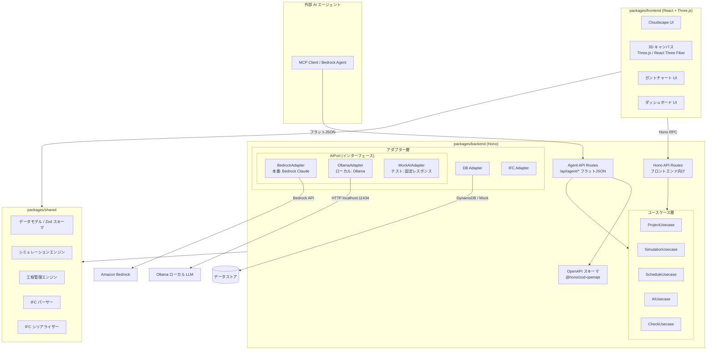
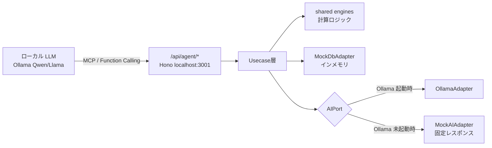

# 技術設計書: IFC レゴ BIM シミュレーター — アーキテクチャ

## アーキテクチャ

### システム全体構成

### 完全オフライン構成（Mock モード）

`MOCK_AWS=true` 環境では、以下の構成により AWS 接続なしで AI エージェント連携を含む全機能が動作する。

### アーキテクチャ上の決定事項

| 決定事項 | 選択 | 理由 |
|----------|------|------|
| 3D レンダリング | Three.js + React Three Fiber | React エコシステムとの統合が容易。宣言的な 3D シーン記述が可能。BIM 用途に十分な性能 |
| IFC パース/シリアライズ | web-ifc (IFC.js) | WebAssembly ベースの高速 IFC パーサー。ブラウザ・Node.js 両対応。IFC2x3/IFC4 サポート |
| ガントチャート | カスタム実装 (SVG/Canvas) | Cloudscape Design System との統合を優先。軽量で依存を最小化 |
| 状態管理 | Zustand | 軽量で TypeScript 親和性が高い。3D シーンの状態管理に適する |
| バリデーション | Zod（既存踏襲） | 既存ボイラープレートとの一貫性。ランタイムバリデーションと型推論の両立 |
| AI 連携 | AIPort + 3 アダプター（BedrockAdapter / OllamaAdapter / MockAIAdapter） | Port/Adapter パターンで抽象化。本番は Bedrock Claude、ローカル開発は Ollama（Qwen/Llama 等）、テストは固定レスポンス Mock。環境変数 `MOCK_AWS` と Ollama 起動状態で自動切替 |
| Agent 専用 API | `/api/agent/*` フラット JSON エンドポイント | フロントエンド用 API とは別に、AI エージェントが呼びやすいシンプルな I/F を提供。既存 Usecase を再利用（DRY） |
| OpenAPI スキーマ自動出力 | `@hono/zod-openapi` | Zod スキーマに `.describe()` を付与し、Bedrock Agent Action Group / MCP ツール定義に直接利用可能な OpenAPI JSON を自動生成 |
| グラフ描画 | Recharts | React ベース。Cloudscape との統合が容易。ダッシュボードのグラフ表示に使用 |
