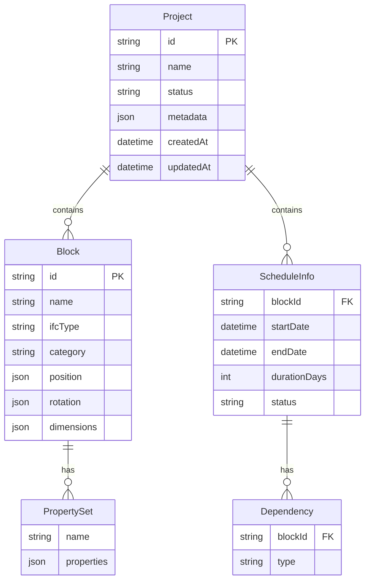

# 技術設計書: IFC レゴ BIM シミュレーター — データモデル

## データモデル

### ブロック (Block)

```typescript
// packages/shared/src/models/block.ts
import { z } from 'zod';

export const BlockCategoryEnum = z.enum([
  'structure',   // 構造体: 壁、柱、梁、スラブ
  'opening',     // 開口部: 窓、ドア
  'equipment',   // 設備: 配管、ダクト
]);

export const IfcElementTypeEnum = z.enum([
  'IfcWall', 'IfcColumn', 'IfcBeam', 'IfcSlab',
  'IfcWindow', 'IfcDoor', 'IfcPipeSegment', 'IfcDuctSegment',
]);

export const Vector3Schema = z.object({
  x: z.number(),
  y: z.number(),
  z: z.number(),
});

export const DimensionsSchema = z.object({
  width: z.number().positive(),
  height: z.number().positive(),
  depth: z.number().positive(),
});

export const PropertyValueSchema = z.union([
  z.string(),
  z.number(),
  z.boolean(),
]);

export const PropertySetSchema = z.object({
  name: z.string().min(1),
  properties: z.record(z.string(), PropertyValueSchema),
});

export const BlockSchema = z.object({
  id: z.string().uuid(),
  name: z.string().min(1),
  ifcType: IfcElementTypeEnum,
  category: BlockCategoryEnum,
  position: Vector3Schema,
  rotation: Vector3Schema,
  dimensions: DimensionsSchema,
  propertySets: z.array(PropertySetSchema),
});

export type Block = z.infer<typeof BlockSchema>;
export type Vector3 = z.infer<typeof Vector3Schema>;
export type Dimensions = z.infer<typeof DimensionsSchema>;
export type PropertySet = z.infer<typeof PropertySetSchema>;
export type PropertyValue = z.infer<typeof PropertyValueSchema>;
export type BlockCategory = z.infer<typeof BlockCategoryEnum>;
export type IfcElementType = z.infer<typeof IfcElementTypeEnum>;
```

### 工程情報 (Schedule)

```typescript
// packages/shared/src/models/schedule.ts
import { z } from 'zod';

export const DependencyTypeEnum = z.enum(['FS', 'SS', 'FF', 'SF']);

export const ProgressStatusEnum = z.enum([
  'not_started',  // 未着手
  'in_progress',  // 進行中
  'completed',    // 完了
]);

export const DependencySchema = z.object({
  blockId: z.string().uuid(),
  type: DependencyTypeEnum,
});

export const ScheduleInfoSchema = z.object({
  blockId: z.string().uuid(),
  startDate: z.string().datetime(),
  endDate: z.string().datetime(),
  durationDays: z.number().int().positive(),
  dependencies: z.array(DependencySchema),
  status: ProgressStatusEnum,
});

export type ScheduleInfo = z.infer<typeof ScheduleInfoSchema>;
export type Dependency = z.infer<typeof DependencySchema>;
export type DependencyType = z.infer<typeof DependencyTypeEnum>;
export type ProgressStatus = z.infer<typeof ProgressStatusEnum>;
```

### プロジェクト (Project)

```typescript
// packages/shared/src/models/project.ts
import { z } from 'zod';
import { BlockSchema } from './block';
import { ScheduleInfoSchema } from './schedule';

export const ProjectStatusEnum = z.enum([
  'draft',       // 作成中
  'active',      // 進行中
  'completed',   // 完了
  'archived',    // アーカイブ済み
]);

export const ProjectMetadataSchema = z.object({
  siteArea: z.number().positive().optional(),       // 敷地面積 (m²)
  zoneType: z.string().optional(),                  // 用途地域
  buildingCoverageLimit: z.number().optional(),     // 建ぺい率上限 (%)
  floorAreaRatioLimit: z.number().optional(),       // 容積率上限 (%)
});

export const ProjectSchema = z.object({
  id: z.string().uuid(),
  name: z.string().min(1),
  status: ProjectStatusEnum,
  metadata: ProjectMetadataSchema,
  blocks: z.array(BlockSchema),
  schedules: z.array(ScheduleInfoSchema),
  createdAt: z.string().datetime(),
  updatedAt: z.string().datetime(),
});

export type Project = z.infer<typeof ProjectSchema>;
export type ProjectStatus = z.infer<typeof ProjectStatusEnum>;
export type ProjectMetadata = z.infer<typeof ProjectMetadataSchema>;

// 一覧表示用の軽量型
export const ProjectSummarySchema = z.object({
  id: z.string().uuid(),
  name: z.string(),
  status: ProjectStatusEnum,
  blockCount: z.number().int().nonnegative(),
  totalCost: z.number().nonnegative().optional(),
  updatedAt: z.string().datetime(),
  thumbnailUrl: z.string().url().optional(),
});

export type ProjectSummary = z.infer<typeof ProjectSummarySchema>;
```

### シミュレーション結果

```typescript
// packages/shared/src/models/simulation-result.ts
import { z } from 'zod';

// 数量算出結果
export const QuantityResultSchema = z.object({
  byType: z.record(z.string(), z.object({
    volume: z.number().nonnegative(),
    area: z.number().nonnegative(),
    length: z.number().nonnegative(),
    count: z.number().int().nonnegative(),
  })),
  total: z.object({
    volume: z.number().nonnegative(),
    area: z.number().nonnegative(),
    count: z.number().int().nonnegative(),
  }),
});

// コスト概算結果
export const CostResultSchema = z.object({
  byType: z.record(z.string(), z.object({
    cost: z.number().nonnegative(),
    count: z.number().int().nonnegative(),
  })),
  total: z.number().nonnegative(),
  uncostedBlocks: z.array(z.string()), // Pset_Cost 未設定ブロック ID
});

// 干渉チェック結果
export const ClashResultSchema = z.object({
  clashes: z.array(z.object({
    blockIdA: z.string().uuid(),
    blockIdB: z.string().uuid(),
    intersectionPoint: z.object({ x: z.number(), y: z.number(), z: z.number() }),
    intersectionVolume: z.number().positive(),
  })),
  message: z.string().optional(),
});

// クリティカルパス分析結果
export const CriticalPathResultSchema = z.object({
  criticalPath: z.array(z.string().uuid()),
  totalDuration: z.number().int().nonnegative(),
  projectStartDate: z.string().datetime(),
  projectEndDate: z.string().datetime(),
  blockAnalysis: z.array(z.object({
    blockId: z.string().uuid(),
    earliestStart: z.string().datetime(),
    earliestFinish: z.string().datetime(),
    latestStart: z.string().datetime(),
    latestFinish: z.string().datetime(),
    floatDays: z.number().int().nonnegative(),
  })),
});

// 構造チェック結果
export const StructureCheckResultSchema = z.object({
  violations: z.array(z.object({
    blockId: z.string().uuid(),
    blockName: z.string(),
    ruleName: z.string(),
    description: z.string(),
    recommendation: z.string(),
  })),
  passed: z.boolean(),
});

// 法規チェック結果
export const RegulationCheckResultSchema = z.object({
  items: z.array(z.object({
    name: z.string(),
    calculatedValue: z.number(),
    limitValue: z.number(),
    unit: z.string(),
    compliant: z.boolean(),
    description: z.string().optional(),
  })),
  allCompliant: z.boolean(),
});

export type QuantityResult = z.infer<typeof QuantityResultSchema>;
export type CostResult = z.infer<typeof CostResultSchema>;
export type ClashResult = z.infer<typeof ClashResultSchema>;
export type CriticalPathResult = z.infer<typeof CriticalPathResultSchema>;
export type StructureCheckResult = z.infer<typeof StructureCheckResultSchema>;
export type RegulationCheckResult = z.infer<typeof RegulationCheckResultSchema>;
```

### AI 連携結果

```typescript
// packages/shared/src/models/ai-result.ts
import { z } from 'zod';
import { BlockSchema } from './block';

// ブロック生成結果（自然言語モデリング）
export const BlockGenerationResultSchema = z.object({
  blocks: z.array(BlockSchema),
  description: z.string(),           // 生成に使用した入力テキスト
  confidence: z.number().min(0).max(1), // 生成の信頼度
});

// 画像解析結果
export const ImageAnalysisResultSchema = z.object({
  detectedElements: z.array(z.object({
    block: BlockSchema,
    confidence: z.number().min(0).max(100), // 信頼度スコア (0-100%)
  })),
  sourceImageSize: z.object({ width: z.number(), height: z.number() }),
});

// 構造提案
export const StructureSuggestionSchema = z.object({
  description: z.string(),           // 提案内容
  reason: z.string(),                // 理由（構造ルールの根拠）
  priority: z.enum(['high', 'medium', 'low']),
  suggestedBlocks: z.array(BlockSchema), // 追加すべきブロック
});

export type BlockGenerationResult = z.infer<typeof BlockGenerationResultSchema>;
export type ImageAnalysisResult = z.infer<typeof ImageAnalysisResultSchema>;
export type StructureSuggestion = z.infer<typeof StructureSuggestionSchema>;
```

### エンティティ関連図


